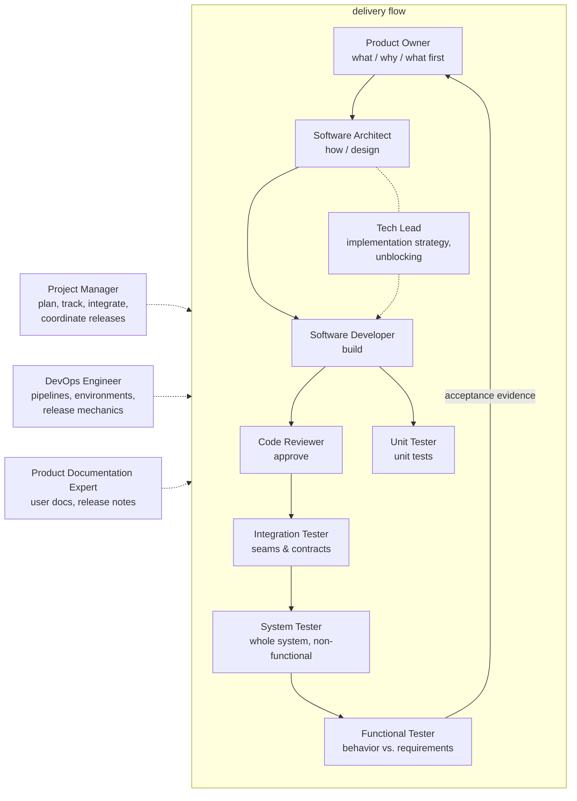
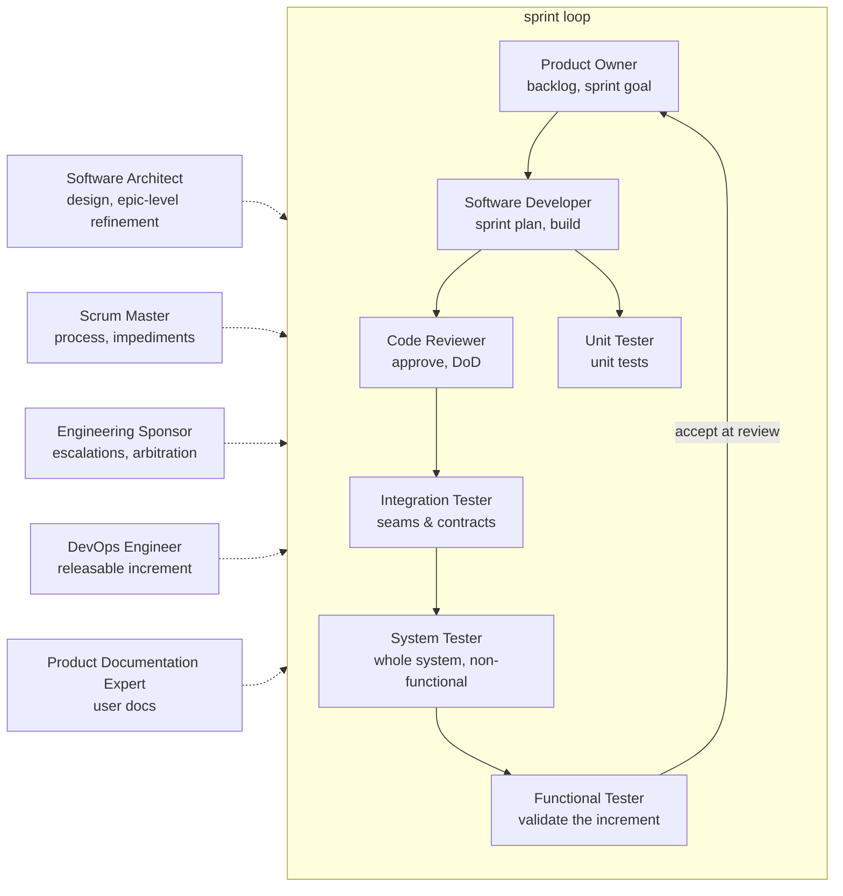

# Agents

A collection of generic, project-agnostic roles (`roles/`) assembled into **rosters** — named
line-ups for a chosen way of working. One roster is active at a time; only its roles take tasks.
Technology-, pattern-, and framework-specific know-how lives in [skills](skills/README.md) loaded
on demand.

## Routing

Each role takes what matches its scope and delegates the rest to the obvious owner; each role
file's **Delegation & escalation** section defines what to hand off, to whom, and when to escalate
to the human. If a referenced role is not in the active roster, route to the nearest roster
member, else to the human. Each role file's `roster` frontmatter lists the rosters it belongs to.

A new engagement starts from the human's project vision, constraints, and technology stack: the
Product Owner turns the vision into requirements, and the Software Architect fits the design to
the stack.

## Rosters

### Core (default)

Methodology-agnostic — the complete generic line-up. The Project Manager plans and coordinates
work that spans several roles. Release management is a shared function: the Product Owner decides
go/no-go, the Project Manager coordinates, the DevOps Engineer executes the mechanics, and the
Product Documentation Expert writes the notes.

| Role | File | Owns |
|------|------|------|
| Product Owner | [roles/product-owner.md](roles/product-owner.md) | Requirements, acceptance criteria, backlog priority, scope, release go/no-go |
| Project Manager | [roles/project-manager.md](roles/project-manager.md) | Planning, breakdown, tracking, integration, release coordination |
| Software Architect | [roles/software-architect.md](roles/software-architect.md) | Design, structure, interfaces, standards, decisions |
| Tech Lead | [roles/tech-lead.md](roles/tech-lead.md) | Implementation strategy, technical unblocking, tech debt, conventions |
| Software Developer | [roles/software-developer.md](roles/software-developer.md) | Implementation, bug fixes, refactoring |
| Code Reviewer | [roles/code-reviewer.md](roles/code-reviewer.md) | Change review, standards, approval |
| Unit Tester | [roles/unit-tester.md](roles/unit-tester.md) | Unit testing, mocking, stubbing |
| Integration Tester | [roles/integration-tester.md](roles/integration-tester.md) | Interface & contract verification between components and systems |
| System Tester | [roles/system-tester.md](roles/system-tester.md) | Whole-system verification: e2e technical flows, non-functional criteria |
| Functional Tester | [roles/functional-tester.md](roles/functional-tester.md) | Behavior validation against requirements; acceptance evidence |
| DevOps Engineer | [roles/devops-engineer.md](roles/devops-engineer.md) | CI/CD, environments, deployment, release mechanics, observability |
| Product Documentation Expert | [roles/product-documentation-expert.md](roles/product-documentation-expert.md) | User-facing docs, release notes, changelog |

### Scrum

No Project Manager: the developers own the sprint plan, the Scrum Master owns the process, and the
Engineering Sponsor holds the boundary to the human. Responsibilities tagged **Scrum:** in the
role files apply only while this roster is active.

| Role | File | Owns |
|------|------|------|
| Product Owner | [roles/product-owner.md](roles/product-owner.md) | Backlog & priority, sprint goal, acceptance at sprint review, release go/no-go |
| Scrum Master | [roles/scrum-master.md](roles/scrum-master.md) | Process, facilitation, impediments, focus |
| Engineering Sponsor | [roles/engineering-sponsor.md](roles/engineering-sponsor.md) | Escalations, arbitration, resources, boundary to the human |
| Software Architect | [roles/software-architect.md](roles/software-architect.md) | Design, standards; epic/feature-level refinement |
| Software Developer | [roles/software-developer.md](roles/software-developer.md) | Implementation; sprint breakdown & estimation |
| Code Reviewer | [roles/code-reviewer.md](roles/code-reviewer.md) | Change review; Definition of Done |
| Unit Tester | [roles/unit-tester.md](roles/unit-tester.md) | Unit testing, mocking, stubbing |
| Integration Tester | [roles/integration-tester.md](roles/integration-tester.md) | Interface & contract verification between components and systems |
| System Tester | [roles/system-tester.md](roles/system-tester.md) | Whole-system verification: e2e technical flows, non-functional criteria |
| Functional Tester | [roles/functional-tester.md](roles/functional-tester.md) | Increment validation before the sprint review |
| DevOps Engineer | [roles/devops-engineer.md](roles/devops-engineer.md) | Releasable increment; pipelines, environments |
| Product Documentation Expert | [roles/product-documentation-expert.md](roles/product-documentation-expert.md) | User-facing docs, release notes |

