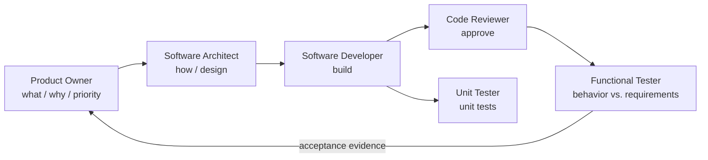
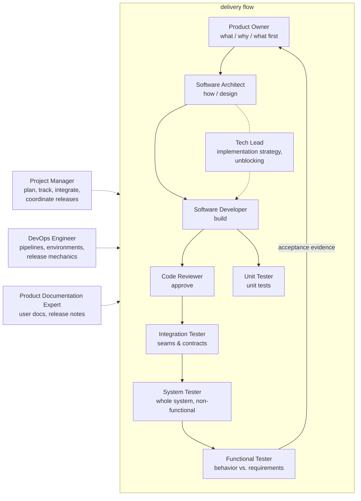
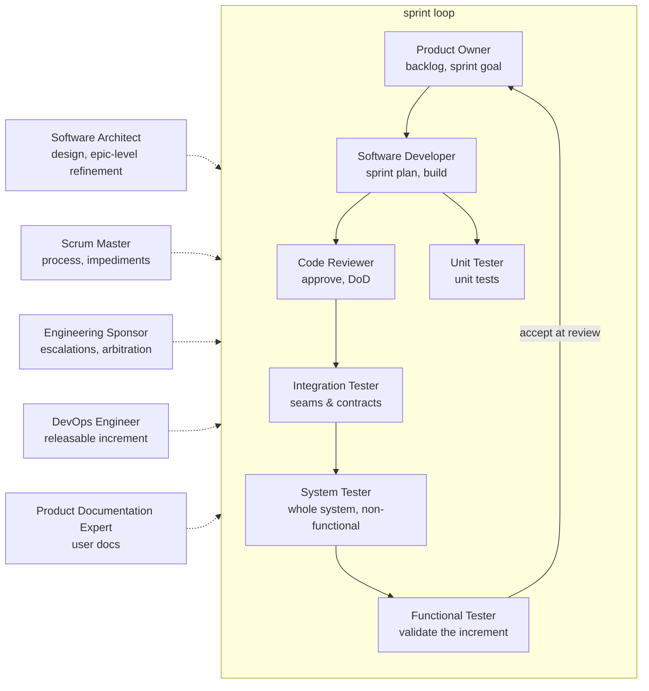

# Agents

Routing rules and roster line-ups for the agent collection — see [README](README.md) for the
overview. One roster is active at a time; only its agents take tasks; technology-specific know-how
lives in [skills](skills/README.md), loaded on demand.

## Routing

Each agent takes what matches its scope and delegates the rest to the obvious owner; each agent
file's **Delegation & escalation** section defines what to hand off, to whom, and when to escalate
to the human. If a referenced role is not in the active roster, route to the nearest roster
member, else to the human. Each agent file's `roster` frontmatter lists the rosters it belongs to.

A new engagement starts from the human's project vision, constraints, and technology stack: the
Product Owner turns the vision into requirements, and the Software Architect fits the design to
the stack.

## Rosters

### Lightweight (default)

The classic flow trimmed for small projects. No Project Manager, Tech Lead, or DevOps Engineer —
coordination sits directly with the human, and the missing-role rule routes everything else to
the nearest member.

| Role | File | Owns |
|------|------|------|
| Product Owner | [agents/product-owner.agent.md](agents/product-owner.agent.md) | Requirements, priority, scope, acceptance |
| Software Architect | [agents/software-architect.agent.md](agents/software-architect.agent.md) | Design, structure, interfaces, standards |
| Software Developer | [agents/software-developer.agent.md](agents/software-developer.agent.md) | Implementation, bug fixes, refactoring |
| Code Reviewer | [agents/code-reviewer.agent.md](agents/code-reviewer.agent.md) | Change review, approval |
| Unit Tester | [agents/unit-tester.agent.md](agents/unit-tester.agent.md) | Unit testing, mocking, stubbing |
| Functional Tester | [agents/functional-tester.agent.md](agents/functional-tester.agent.md) | Behavior validation; acceptance evidence |

### Classic

The complete, methodology-agnostic line-up. The Project Manager plans and coordinates work that
spans several roles. Release management is a shared function: the Product Owner decides go/no-go,
the Project Manager coordinates, the DevOps Engineer executes the mechanics, and the Product
Documentation Expert writes the notes.

| Role | File | Owns |
|------|------|------|
| Product Owner | [agents/product-owner.agent.md](agents/product-owner.agent.md) | Requirements, acceptance criteria, backlog priority, scope, release go/no-go |
| Project Manager | [agents/project-manager.agent.md](agents/project-manager.agent.md) | Planning, breakdown, tracking, integration, release coordination |
| Software Architect | [agents/software-architect.agent.md](agents/software-architect.agent.md) | Design, structure, interfaces, standards, decisions |
| Tech Lead | [agents/tech-lead.agent.md](agents/tech-lead.agent.md) | Implementation strategy, technical unblocking, tech debt, conventions |
| Software Developer | [agents/software-developer.agent.md](agents/software-developer.agent.md) | Implementation, bug fixes, refactoring |
| Code Reviewer | [agents/code-reviewer.agent.md](agents/code-reviewer.agent.md) | Change review, standards, approval |
| Unit Tester | [agents/unit-tester.agent.md](agents/unit-tester.agent.md) | Unit testing, mocking, stubbing |
| Integration Tester | [agents/integration-tester.agent.md](agents/integration-tester.agent.md) | Interface & contract verification between components and systems |
| System Tester | [agents/system-tester.agent.md](agents/system-tester.agent.md) | Whole-system verification: e2e technical flows, non-functional criteria |
| Functional Tester | [agents/functional-tester.agent.md](agents/functional-tester.agent.md) | Behavior validation against requirements; acceptance evidence |
| DevOps Engineer | [agents/devops-engineer.agent.md](agents/devops-engineer.agent.md) | CI/CD, environments, deployment, release mechanics, observability |
| Product Documentation Expert | [agents/product-documentation-expert.agent.md](agents/product-documentation-expert.agent.md) | User-facing docs, release notes, changelog |

### Scrum

No Project Manager: the developers own the sprint plan, the Scrum Master owns the process, and the
Engineering Sponsor holds the boundary to the human. Responsibilities tagged **Scrum:** in the
role files apply only while this roster is active.

| Role | File | Owns |
|------|------|------|
| Product Owner | [agents/product-owner.agent.md](agents/product-owner.agent.md) | Backlog & priority, sprint goal, acceptance at sprint review, release go/no-go |
| Scrum Master | [agents/scrum-master.agent.md](agents/scrum-master.agent.md) | Process, facilitation, impediments, focus |
| Engineering Sponsor | [agents/engineering-sponsor.agent.md](agents/engineering-sponsor.agent.md) | Escalations, arbitration, resources, boundary to the human |
| Software Architect | [agents/software-architect.agent.md](agents/software-architect.agent.md) | Design, standards; epic/feature-level refinement |
| Software Developer | [agents/software-developer.agent.md](agents/software-developer.agent.md) | Implementation; sprint breakdown & estimation |
| Code Reviewer | [agents/code-reviewer.agent.md](agents/code-reviewer.agent.md) | Change review; Definition of Done |
| Unit Tester | [agents/unit-tester.agent.md](agents/unit-tester.agent.md) | Unit testing, mocking, stubbing |
| Integration Tester | [agents/integration-tester.agent.md](agents/integration-tester.agent.md) | Interface & contract verification between components and systems |
| System Tester | [agents/system-tester.agent.md](agents/system-tester.agent.md) | Whole-system verification: e2e technical flows, non-functional criteria |
| Functional Tester | [agents/functional-tester.agent.md](agents/functional-tester.agent.md) | Increment validation before the sprint review |
| DevOps Engineer | [agents/devops-engineer.agent.md](agents/devops-engineer.agent.md) | Releasable increment; pipelines, environments |
| Product Documentation Expert | [agents/product-documentation-expert.agent.md](agents/product-documentation-expert.agent.md) | User-facing docs, release notes |

