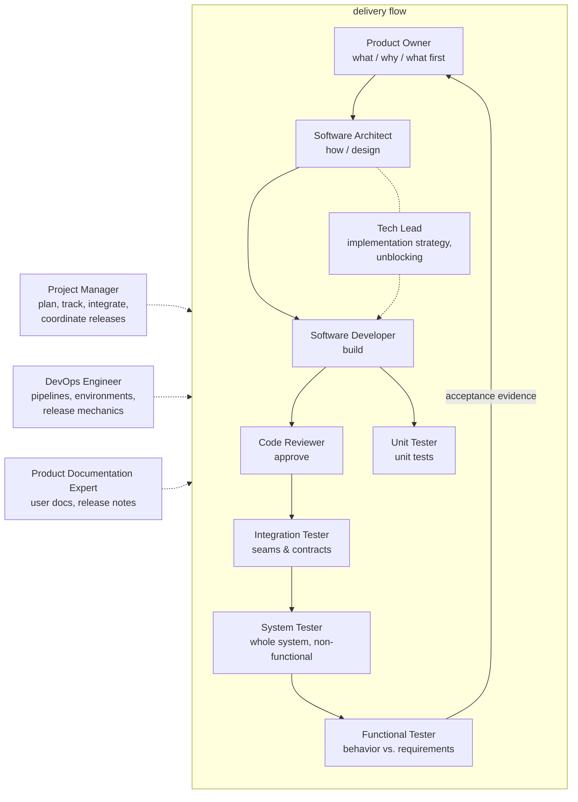

# Classic roster

The complete, methodology-agnostic line-up. The Project Manager plans and coordinates work that
spans several roles. Release management is a shared function: the Product Owner decides go/no-go,
the Project Manager coordinates, the DevOps Engineer executes the mechanics, and the Product
Documentation Expert writes the notes.

| Role | File | Owns |
|------|------|------|
| Product Owner | [agents/product-owner.agent.md](../agents/product-owner.agent.md) | Requirements, acceptance criteria, backlog priority, scope, release go/no-go |
| Project Manager | [agents/project-manager.agent.md](../agents/project-manager.agent.md) | Planning, breakdown, tracking, integration, release coordination |
| Software Architect | [agents/software-architect.agent.md](../agents/software-architect.agent.md) | Design, structure, interfaces, standards, decisions |
| Tech Lead | [agents/tech-lead.agent.md](../agents/tech-lead.agent.md) | Implementation strategy, technical unblocking, tech debt, conventions |
| Software Developer | [agents/software-developer.agent.md](../agents/software-developer.agent.md) | Implementation, bug fixes, refactoring |
| Code Reviewer | [agents/code-reviewer.agent.md](../agents/code-reviewer.agent.md) | Change review, standards, approval |
| Unit Tester | [agents/unit-tester.agent.md](../agents/unit-tester.agent.md) | Unit testing, mocking, stubbing |
| Integration Tester | [agents/integration-tester.agent.md](../agents/integration-tester.agent.md) | Interface & contract verification between components and systems |
| System Tester | [agents/system-tester.agent.md](../agents/system-tester.agent.md) | Whole-system verification: e2e technical flows, non-functional criteria |
| Functional Tester | [agents/functional-tester.agent.md](../agents/functional-tester.agent.md) | Behavior validation against requirements; acceptance evidence |
| DevOps Engineer | [agents/devops-engineer.agent.md](../agents/devops-engineer.agent.md) | CI/CD, environments, deployment, release mechanics, observability |
| Product Documentation Expert | [agents/product-documentation-expert.agent.md](../agents/product-documentation-expert.agent.md) | User-facing docs, release notes, changelog |

