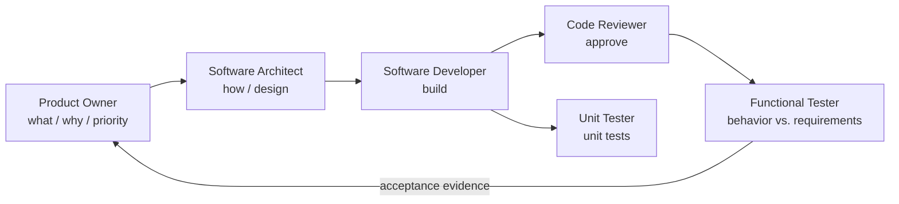

# Lightweight roster

The classic flow trimmed for small projects. No Project Manager, Tech Lead, or DevOps Engineer —
coordination sits directly with the human, and the missing-role rule routes everything else to
the nearest member.

| Role | File | Owns |
|------|------|------|
| Product Owner | [agents/product-owner.agent.md](../agents/product-owner.agent.md) | Requirements, priority, scope, acceptance |
| Software Architect | [agents/software-architect.agent.md](../agents/software-architect.agent.md) | Design, structure, interfaces, standards |
| Software Developer | [agents/software-developer.agent.md](../agents/software-developer.agent.md) | Implementation, bug fixes, refactoring |
| Code Reviewer | [agents/code-reviewer.agent.md](../agents/code-reviewer.agent.md) | Change review, approval |
| Unit Tester | [agents/unit-tester.agent.md](../agents/unit-tester.agent.md) | Unit testing, mocking, stubbing |
| Functional Tester | [agents/functional-tester.agent.md](../agents/functional-tester.agent.md) | Behavior validation; acceptance evidence |

