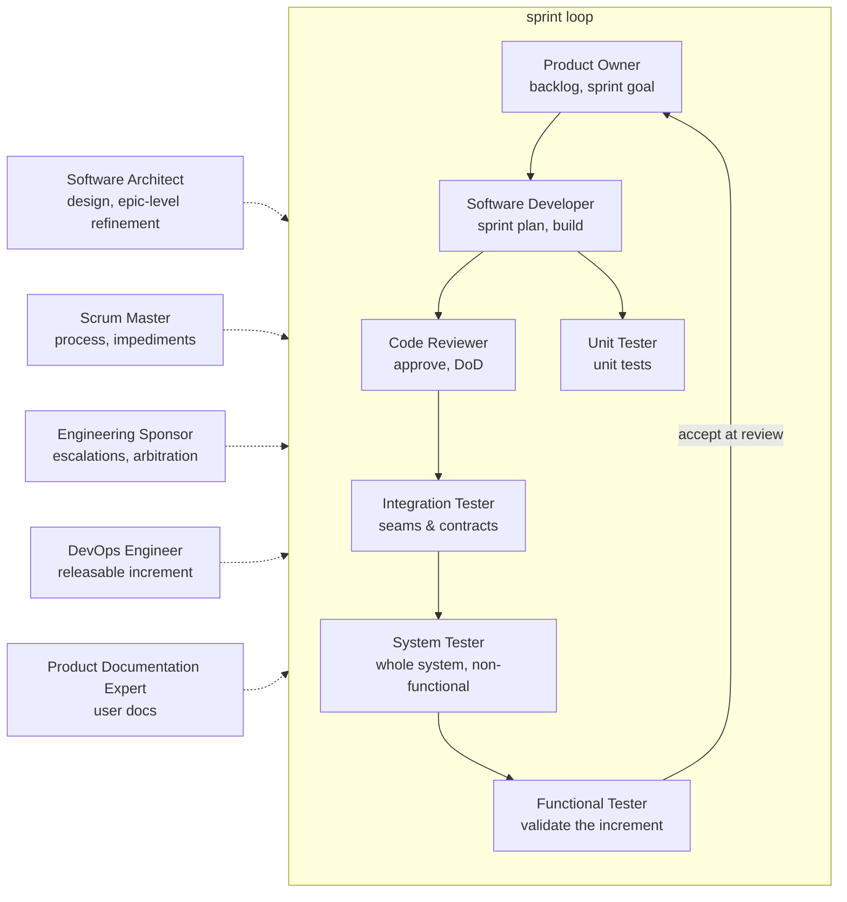

# Scrum roster

No Project Manager: the developers own the sprint plan, the Scrum Master owns the process, and the
Engineering Sponsor holds the boundary to the human. Responsibilities tagged **Scrum:** in the
role files apply only while this roster is active.

| Role | File | Owns |
|------|------|------|
| Product Owner | [agents/product-owner.agent.md](../agents/product-owner.agent.md) | Backlog & priority, sprint goal, acceptance at sprint review, release go/no-go |
| Scrum Master | [agents/scrum-master.agent.md](../agents/scrum-master.agent.md) | Process, facilitation, impediments, focus |
| Engineering Sponsor | [agents/engineering-sponsor.agent.md](../agents/engineering-sponsor.agent.md) | Escalations, arbitration, resources, boundary to the human |
| Software Architect | [agents/software-architect.agent.md](../agents/software-architect.agent.md) | Design, standards; epic/feature-level refinement |
| Software Developer | [agents/software-developer.agent.md](../agents/software-developer.agent.md) | Implementation; sprint breakdown & estimation |
| Code Reviewer | [agents/code-reviewer.agent.md](../agents/code-reviewer.agent.md) | Change review; Definition of Done |
| Unit Tester | [agents/unit-tester.agent.md](../agents/unit-tester.agent.md) | Unit testing, mocking, stubbing |
| Integration Tester | [agents/integration-tester.agent.md](../agents/integration-tester.agent.md) | Interface & contract verification between components and systems |
| System Tester | [agents/system-tester.agent.md](../agents/system-tester.agent.md) | Whole-system verification: e2e technical flows, non-functional criteria |
| Functional Tester | [agents/functional-tester.agent.md](../agents/functional-tester.agent.md) | Increment validation before the sprint review |
| DevOps Engineer | [agents/devops-engineer.agent.md](../agents/devops-engineer.agent.md) | Releasable increment; pipelines, environments |
| Product Documentation Expert | [agents/product-documentation-expert.agent.md](../agents/product-documentation-expert.agent.md) | User-facing docs, release notes |

